# 基于springboot的欢迪迈手机商城

---
### 👉作者QQ ：1556708905 微信：zheng0123Long (支持定制修改、部署调试、定制毕设)

### 👉接网站建设、小程序、H5、APP、各种系统等

---

#### 介绍

欢迪迈手机商城系统是一个基于Spring Boot框架开发的移动端电子商务平台，旨在为用户提供便捷的手机购物体验，并为管理员提供高效的后台管理工具。系统分为两种角色：管理员和用户。管理员负责维护平台的正常运行及各项管理事务；用户则享受购物、浏览商品资讯、管理个人信息等功能。

#### 技术栈

后端技术栈：Springboot+Mysql+Maven

前端技术栈：Vue+Html+Css+Javascript+ElementUI

开发工具：Idea+Vscode+Navicate

#### 系统功能介绍

（一）管理员角色  
个人中心：管理员可以在此查看和修改个人信息，接收系统通知和重要消息。  
用户管理：对商城用户进行综合管理，包括审核新用户注册、查看用户详细资料、处理用户的问题和反馈等。  
商品分类管理：负责创建、修改和删除商品分类，确保商品分类清晰、准确，方便用户查找。  
商品信息管理：对商品的详细信息进行管理，包括商品的名称、描述、规格、价格、库存等，保证商品信息的完整性和准确性。  
商品评价管理：查看用户对商品的评价，对不合理或违规的评价进行处理，以维护良好的购物环境。  
系统管理  
轮播图管理：设置商城首页的轮播图片，展示热门商品、促销活动等重要信息，吸引用户的注意力。  
商品资讯：发布和更新与手机相关的新闻、评测、行业动态等资讯内容，增加用户对手机产品的了解。  
客服管理：管理客服人员的工作安排、培训和绩效考核，确保客服服务的质量和效率。  
订单管理：处理用户的订单，包括确认订单、安排发货、跟踪物流、处理退款和退货等。  

（二）用户角色  
商品信息：浏览各类手机商品的详细信息，包括图片、参数、价格等，以便做出购买决策。  
商品资讯：获取最新的手机行业资讯、产品评测和购买指南等信息，帮助用户更好地了解市场动态。  
个人中心：在个人中心，用户可以修改个人资料、查看订单记录、管理收货地址等。  
后台管理  
商品评价管理：对购买的商品进行评价和打分，分享使用体验，为其他用户提供参考。  
我的收藏管理：收藏感兴趣的商品，方便后续查看和比较。  
购物车：将心仪的商品添加到购物车，调整商品数量，进行结算操作。  
客服：在购物过程中遇到问题时，通过客服渠道与商城工作人员进行沟通和咨询。  

#### 系统作用

欢迪迈手机商城系统的主要作用包括：  

提升用户体验： 提供便捷的商品搜索和购物体验，用户可以随时随地浏览商品、添加购物车并下单购买。  
高效管理： 管理员通过后台系统可以高效管理用户、商品、订单和评价，确保商城的顺利运营。  
信息传递： 通过商品资讯和轮播图管理，管理员可以及时向用户传递最新的商品信息和优惠活动。  
客户服务： 用户可以通过系统方便地与客服沟通，快速解决购物中的问题，提高客户满意度。  

#### 系统功能截图

代码结构

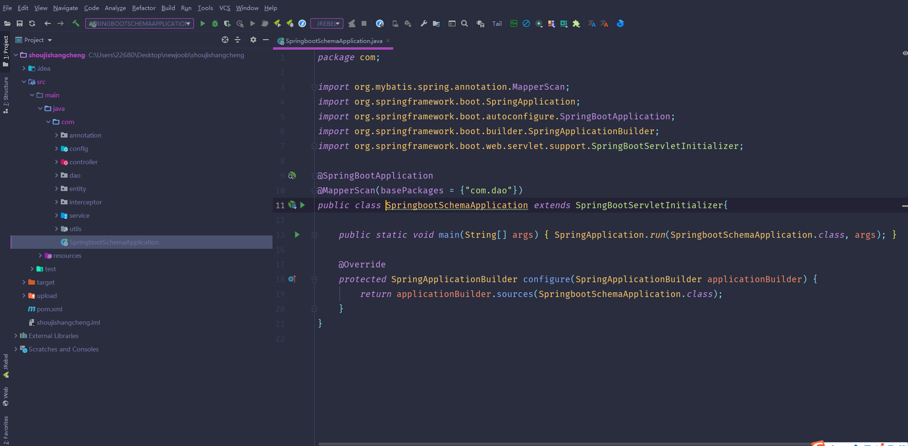

数据库表

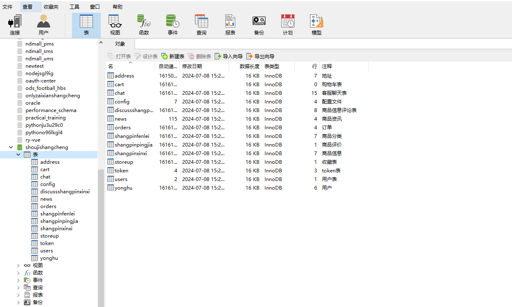

登录

用户管理

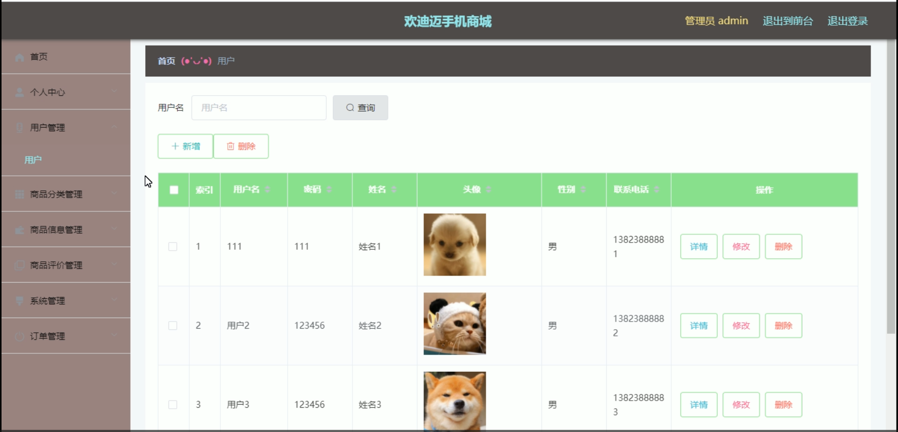

商品分类管理

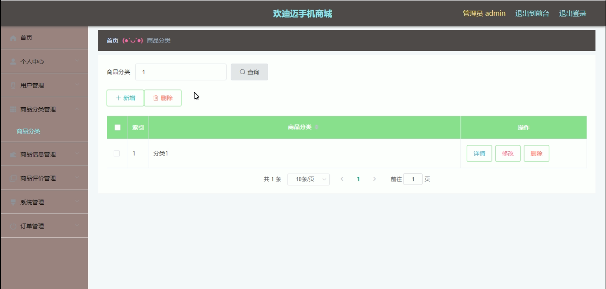

商品信息管理

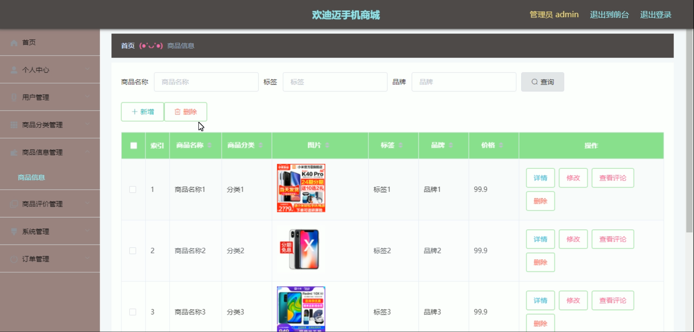

商品评价管理

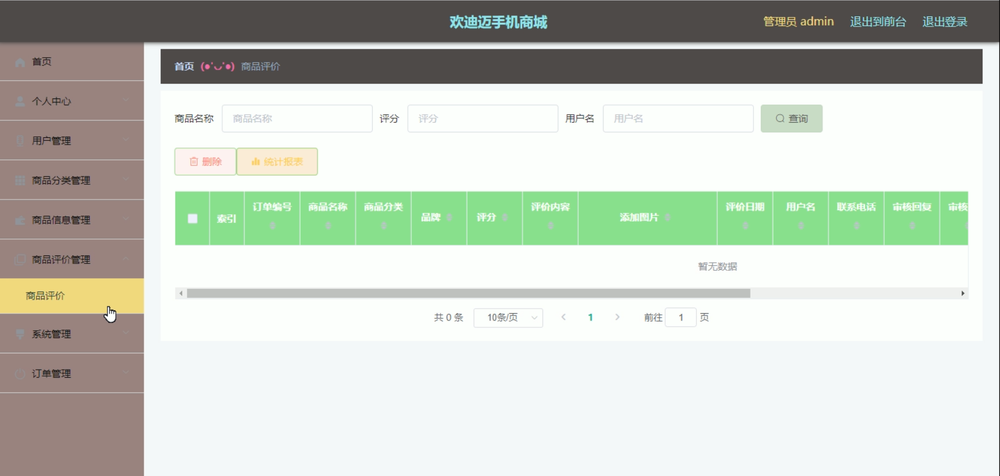

系统管理

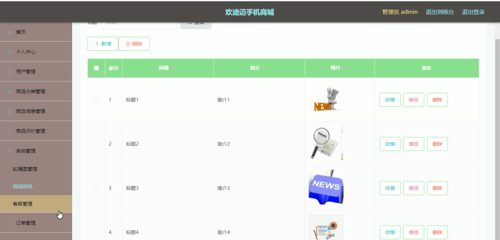

前台页面首页

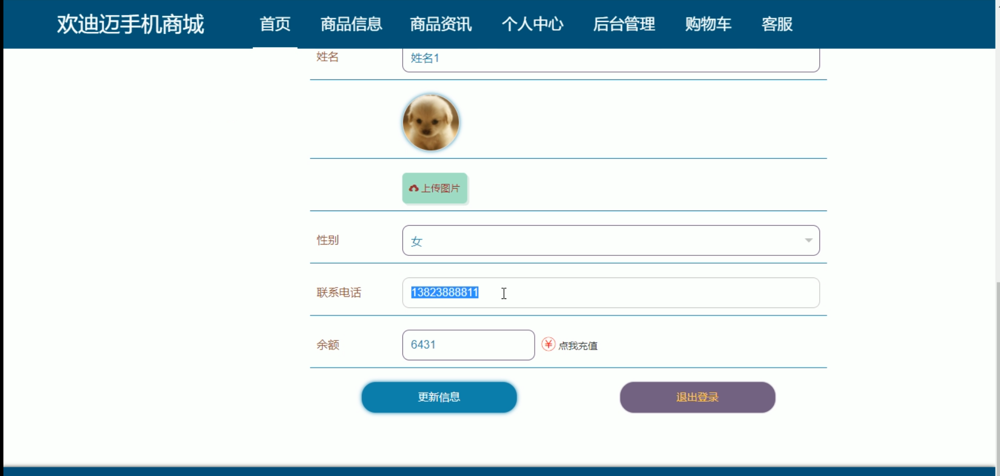

商品资讯

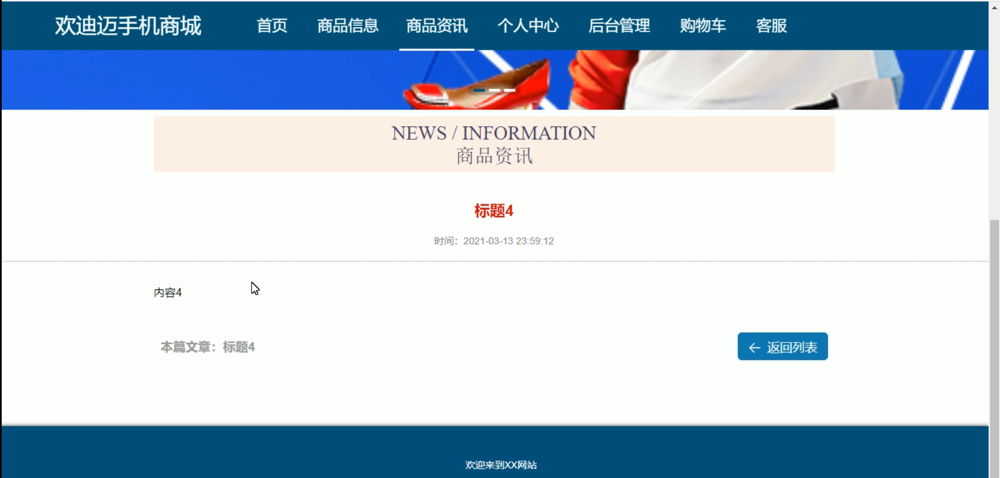

个人中心

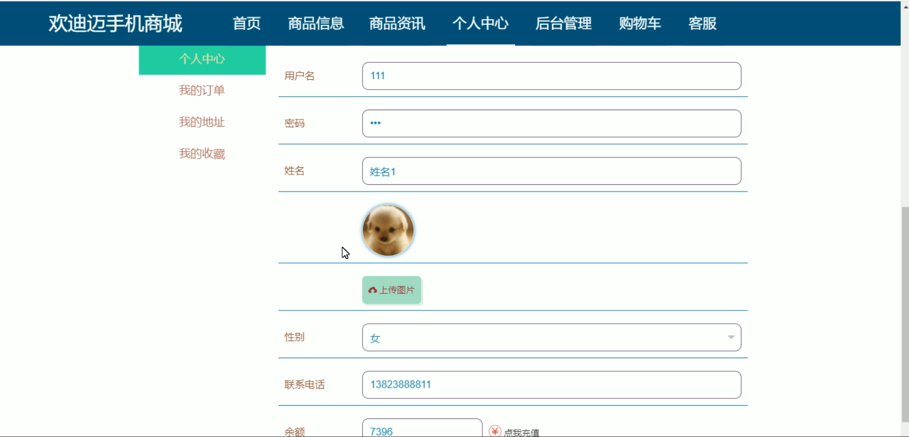

购物车

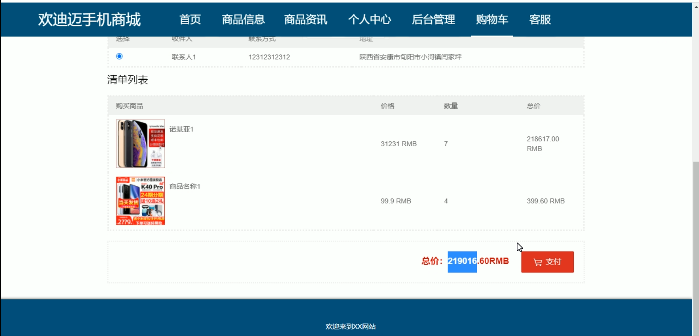

订单管理

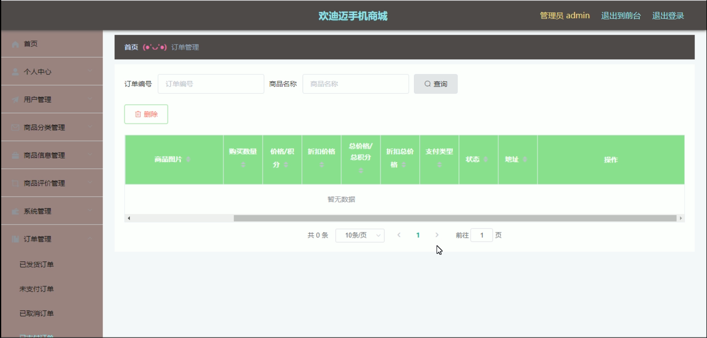

用户端后台管理

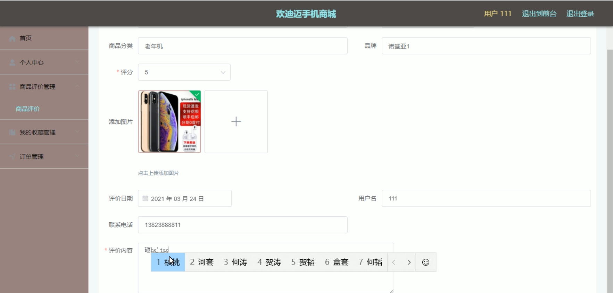

#### 总结

欢迪迈手机商城系统通过分角色管理的方式，实现了用户和管理员不同的需求。用户可以方便地浏览、购买商品，并管理个人信息；管理员则可以高效地管理商城的各个方面，确保商城的正常运行。整个系统的设计和开发基于Spring Boot框架，具有良好的扩展性和维护性，为后续功能的添加和优化提供了坚实的基础。

#### 使用说明

创建数据库，执行数据库脚本 修改jdbc数据库连接参数 下载安装maven依赖jar 启动idea中的springboot项目

网址：http://localhost:8080/shoujishangcheng/admin/dist/index.html 后台管理  http://localhost:8080/shoujishangcheng/front/pages/login/login.html 前台页面

管理员  admin  密码：admin     
